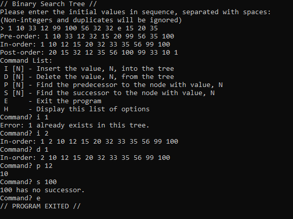

# w18-cs241-project1
Project that demonstrates the basic properties of a binary search tree.

#### Running the program
Once you are in the bin folder, you can run the program with, assuming Java is installed properly:

`java -classpath . edu.cpp.cs.cs241.project1.Project1`

Here is an example of the program:

